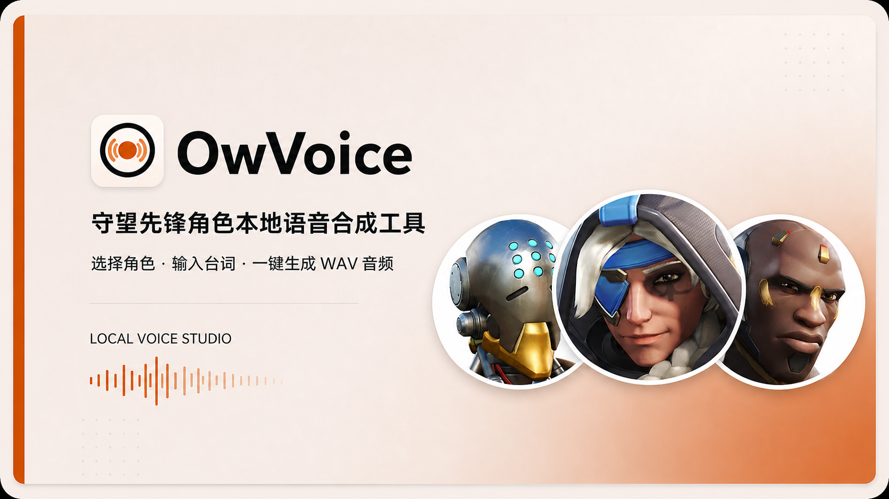
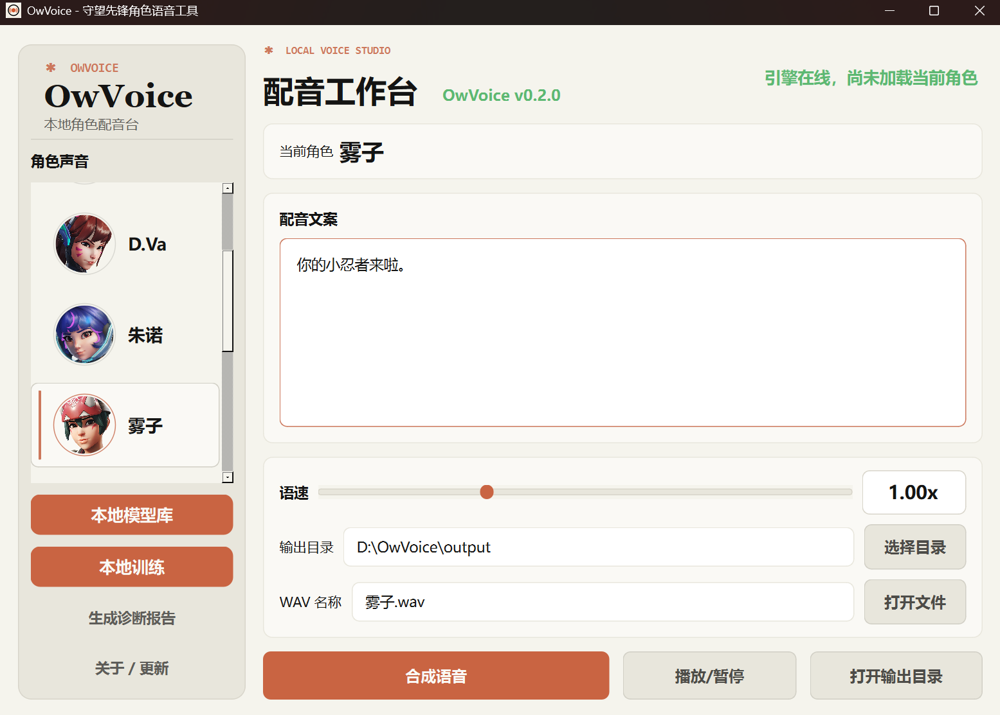
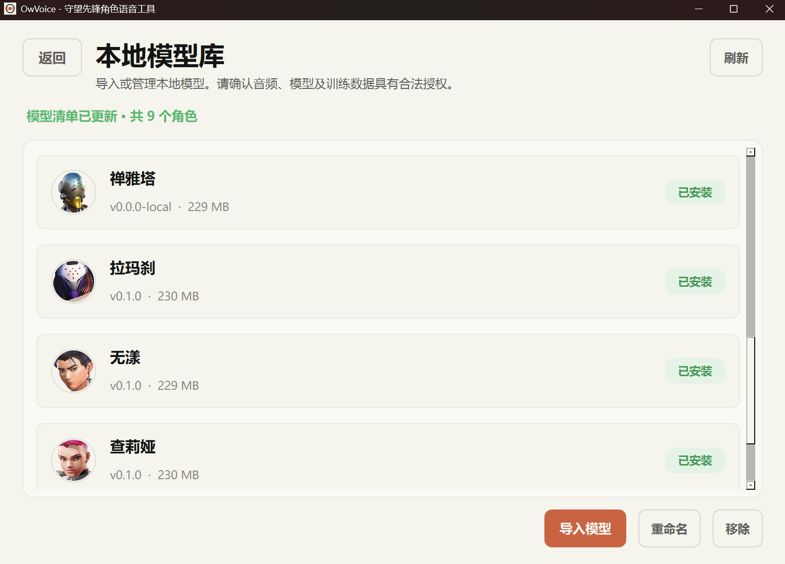
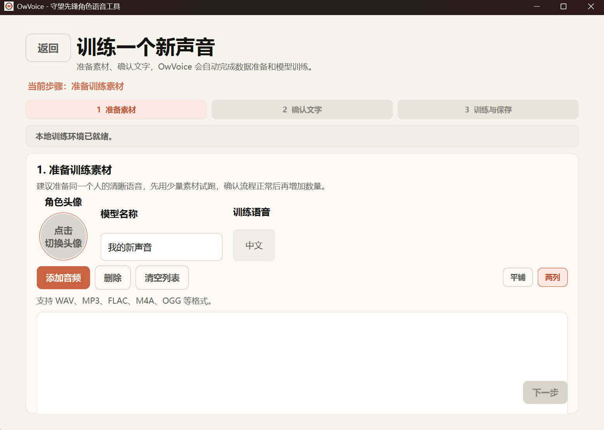

# OwVoice

OwVoice 是一个守望先锋角色本地语音合成工具，使用 GPT-SoVITS 进行本地推理。

学习交流 QQ 群：1121380498，欢迎交流项目问题、改进建议和模型资源。
我会陆续更新模型。

<p align="center">
  
</p>

> 选择角色 → 输入台词 → 一键生成 WAV 音频。
> 适合本地语音合成、个人模型导入和授权素材训练。

<p align="center">
  <a href="https://github.com/Zed2047/OwVoice/releases/latest">下载最新 Release</a>
  ·
  <a href="#普通用户使用">查看使用说明</a>
  ·
  <a href="#合成音频示例">试听合成示例</a>
</p>

## 快速了解

### 主要能力

<table>
  <tr>
    <td width="50%"><strong> 本地语音合成</strong><br>选择本地模型、输入台词，生成可播放和导出的 WAV 文件。</td>
    <td width="50%"><strong> 本地模型库</strong><br>导入、登记和管理自己拥有或训练的模型，不联网下载角色模型。</td>
  </tr>
  <tr>
    <td><strong> 本地训练</strong><br>使用授权音频素材训练新声音，并保存回本地模型库。</td>
    <td><strong> CPU/GPU 模式</strong><br>首次配置时选择运行模式，由桌面程序统一管理环境和更新。</td>
  </tr>
</table>

### 快速开始

```text
下载 Release → 运行 setup.bat → 导入模型或开始训练 → 输入台词并生成 WAV
```

详细安装步骤、环境要求和故障排查见[普通用户使用](#普通用户使用)。

## 界面预览

<p align="center">
  
</p>
<p align="center"><strong>配音工作台：选择角色、输入台词、调整语速并生成 WAV</strong></p>

<table>
  <tr>
    <td align="center"><br><strong>本地模型库</strong><br>导入和管理本地模型</td>
    <td align="center"><br><strong>本地训练</strong><br>准备素材并训练新声音</td>
  </tr>
</table>

## 角色语音示例

下面的 WAV 用于展示本地合成功能，不属于发布包内置资源,详情咨询交流群。

<table>
  <tr>
    <td width="22%" align="center"><br><strong>无漾</strong></td>
    <td valign="middle"><strong>「大专聚会加我一个」</strong><br><audio controls preload="none"><source src="readme-assets/audio/wuyang-dazhuan-juhui.wav" type="audio/wav"></audio><br><a href="readme-assets/audio/wuyang-dazhuan-juhui.wav">下载 WAV</a></td>
  </tr>
  <tr>
    <td align="center"><br><strong>雾子</strong></td>
    <td valign="middle"><strong>「雾子大人在此」</strong><br><audio controls preload="none"><source src="readme-assets/audio/wuzi.wav" type="audio/wav"></audio><br><a href="readme-assets/audio/wuzi.wav">下载 WAV</a></td>
  </tr>
  <tr>
    <td align="center"><br><strong>朱诺</strong></td>
    <td valign="middle"><strong>「小朱诺诺的」</strong><br><audio controls preload="none"><source src="readme-assets/audio/juno-xiaozhunuonuo.wav" type="audio/wav"></audio><br><a href="readme-assets/audio/juno-xiaozhunuonuo.wav">下载 WAV</a></td>
  </tr>
</table>

图片中的角色形象、头像以及音频示例可能涉及第三方素材或模型。它们仅作为项目演示素材，不代表暴雪娱乐官方内容，也不随 OwVoice 发布包提供；公开使用或传播前请确认你拥有相应授权。

> 说明：此前的旧版 Release 因版权问题下架。项目现已调整为面向学习、训练和测试的工具，支持用户自行训练和导入本地模型；公开源码和发布包不包含角色模型权重、角色参考音频或角色头像。

## 普通用户使用

### 1. 下载

请从 GitHub 的 **Releases** 下载 `OwVoice-v*.zip`，不要下载页面上的 `Source code` 压缩包。

将 ZIP 解压到一个有足够空间、并且有读写权限的目录，例如 `D:\OwVoice`。不建议解压到 `C:\Program Files` 等受保护目录。

### 2. 使用前准备

- Windows 10/11 64 位
- 首次配置需要联网
- CPU 模式不需要 NVIDIA 显卡；GPU 模式需要 NVIDIA 显卡和 570 或更高版本驱动
- CPU 模式至少预留 15GB，GPU 模式至少预留 24GB；可选训练还会额外下载训练底模
- Microsoft Visual C++ 2015-2022 x64 运行库（多数 Windows 10/11 已自带；缺失时安装器会给出官方地址）

建议使用GPU,是主要开发环境，效率高，速度快。CPU兼容性好，但速度较慢。如需切换模式，可关闭 OwVoice 后重新运行 `setup.bat` 并选择模式。

需要先安装并配置可从 `python.exe` 调用的 CPython 3.10.x x64（支持范围 `>=3.10,<3.11`）；新用户推荐使用当前开发与发布测试版本 3.10.10，3.10.21 也已通过兼容性测试。不需要 C/C++、CMake 或 Visual Studio。发布包内置经过校验的 `uv`，会用兼容解释器创建项目 `.venv` 并按 `uv.lock` 安装完整锁定依赖，不修改系统 Python、PATH 或注册表；随后根据 `resource-lock.json` 下载并校验 FFmpeg、G2PW、GPT-SoVITS、FastText 与 NLTK 资源。

### 3. 首次配置

1. 双击 `setup.bat`。
2. 选择 CPU 或 GPU：GPU 下载多但推理快；CPU 下载少但推理慢；
3. 等待窗口显示配置完成。
4. 配置完成后关闭窗口。

首次配置因为要配置环境、下载公共底模，可能需要较长时间，请不要中途关闭窗口。

下载中断后可以直接重新运行 `setup.bat`；下载缓存和已完成步骤会复用，不需要删除 `.venv`。如果安装器判断旧环境必须重建，会先说明原因并要求确认；拒绝后不会切换现有环境。完整 FastText 语言检测模型下载失败时，安装器会明确提示并使用较小的内置模型，不会因此阻塞安装；之后可重新运行 `setup.bat` 补下载。
之后使用时直接双击 `OwVoice.exe`，不需要再次运行配置脚本。

### 4. 生成语音

全新安装不会自带角色模型。第一次打开会进入空工作台，不是安装失败；

可以在“本地模型库”导入有权使用的模型，或“本地训练”创建模型。导入首个有效模型后再进行合成：

1. 选择角色。
2. 输入配音文案。
3. 拖动语速滑块，或点击倍率数字精确输入。语速范围为 `0.10x` 到 `3.00x`。
4. 设置 WAV 文件名和输出目录。
5. 点击“合成语音”。
6. 合成完成后可以播放、打开文件或删除 WAV 文件。

“本地模型库”只管理用户自行导入或训练的本地模型，不会联网下载角色模型。“检查更新”可更新程序和 GPT-SoVITS 代码；开始前会显示环境变化和预计空间，只有明确同意后才执行。
模型、配置、训练记录、输出和缓存会保留。

如果更新过程中断或电脑意外关机，请先关闭 OwVoice，再双击安装目录中的 `recover_update.bat`。恢复入口会根据记录自动恢复完整旧版本；恢复后可以重新打开程序并再次检查更新，不会删除模型、配置或输出文件。

> v0.1.2 升级到 v0.2.0：先关闭 OwVoice，再确认系统可调用 CPython 3.10.x x64，下载 `UpdateBridge-v0.2.0.zip`，把压缩包内容解压到原 OwVoice 目录并允许覆盖，双击 `修复更新器.bat`。桥接会优先复制并复用兼容的旧 `.venv`，再按锁文件只同步发生变化的依赖；Python 3.10.21 和版本完全相同的 Torch 不会仅因补丁版本不同而重下。执行前会显示 CPU/GPU 模式、最坏情况下载量与磁盘需求，并要求明确确认。取消不会开始迁移；失败会恢复旧程序和旧环境。模型、配置、训练记录、头像和输出不会删除。这是旧版用户唯一需要执行的一次手动桥接；从 v0.2.0 开始可继续使用程序内自动更新。

> 提示：首次启动通常需要约 15 秒加载语音引擎，请耐心等待。

## 常见问题

### 首次配置提示找不到运行环境

v0.2.0 发布包不会自动安装 Python（后续版本再完善）。首次配置前，请安装 CPython 3.10.x x64 并加入 PATH。

可以在 PowerShell 中执行 `python --version`，确认输出为 3.10 系列版本；安装器还会进一步检查 Python 是否为 64 位 CPython。

v0.2.0 推荐使用 3.10.10；3.10.21 也已通过兼容性验证。

然后确认下载的是完整 Release ZIP、已完整解压且目录可写，再运行 `setup.bat`。安装可以断点续传并复用已完成步骤。若仍失败，请把 `logs` 目录中最新的 `setup-*.log` 和 `environment-report.txt` 发给维护者；不要发送密码或令牌。

排查时应同时说明选择的是 CPU 还是 GPU。AI 只应根据环境报告和完整报错给出检查建议；不要发送密码、令牌等敏感信息，也不要直接执行来源不明的命令。

### PyTorch、CUDA 或显卡错误

GPU 模式请确认 NVIDIA 驱动和 `nvidia-smi` 正常；没有 NVIDIA 显卡时请选择 CPU。详细错误可查看 `logs` 目录中的日志文件。

### 合成失败

请先确认首次配置已经完成，然后查看：

- `logs\gpt_sovits.error.log`
- `logs\backend.error.log`
- `logs\warmup.error.log`

也可以点击侧边栏“生成诊断报告”。报告只在用户主动点击后生成到 `logs\diagnostics`，不会自动上传；分享前仍应自行检查内容。

### 解压后出现旧角色模型，或导入提示“目标模型目录已存在但尚未登记”

这通常是旧发布包或旧测试目录残留了模型注册表。请使用最新 Release ZIP 解压到一个新的空目录；新包不包含角色模型，注册表也会从空文件开始。已有完整模型目录可通过“导入模型”选择整个 `data\models` 进行原地登记，旧的绝对路径会迁移为当前目录下的相对路径。

如果提示端口被另一套 OwVoice 占用，请先关闭其他安装目录中的 OwVoice，再启动当前目录的程序。

### 启动很慢

首次启动需要加载模型和启动本地服务，等待时间较长属于正常现象。启动页会显示当前阶段和进度。

### 可选：本地训练

点击侧边栏“本地训练”后，程序会先检查训练环境。只有确认安装时，才会安装训练依赖并下载训练预训练模型；基础推理用户不需要承担这部分下载。

本地训练推荐使用 GPU。训练运行时会根据 `torch.cuda.is_available()` 自动选择设备：当前环境有可用 CUDA 时使用 GPU，否则使用 CPU。CPU 可以运行，但速度会明显变慢。训练需要用户自行准备并确认拥有授权的音频、参考音频和头像素材。

训练向导流程：

1. 填写模型名称并选择训练语言。
2. 上传自己的语音素材（支持 WAV、MP3、FLAC、M4A 等）。
3. 点击“自动识别文本”，检查、修改并保存文本。
4. 点击“准备训练数据”后开始训练；训练期间可以最小化窗口。
5. 训练完成后点击“保存到本地模型库”，返回工作台即可使用。

任务文件保存在 `data\training\jobs`，每个任务的日志在对应目录的 `training.log`。当前自动识别以中文为主；其他语言可以手动填写文本，但仍需要相应训练资源。

默认安装只准备推理、桌面界面和后端环境，不下载或内置角色模型权重。首次配置遇到 NLTK 报错时，可以重新运行 `setup.bat`；也可以在项目目录执行：

```powershell
.\.venv\Scripts\python.exe scripts\download_nltk_data.py
```

开发者发布前统一运行测试：

```powershell
.\.venv\Scripts\python.exe -m pytest -q
```

`scripts\start_training.ps1` 仅供开发者排查 GPT-SoVITS 原始 WebUI，不是普通用户入口。训练失败时，应优先查看 OwVoice 向导中的训练日志。

## 发布包内容

发布 ZIP 中包含：

- `OwVoice.exe` 和运行文件
- `setup.bat` 首次配置脚本
- 内置签名版 `uv`、CPython 3.10.x x64 兼容性校验和完整依赖锁；新安装推荐 3.10.10，CPU/GPU 环境分别安装并按选择切换
- 本地模型库目录（初始为空，模型和参考音频需由用户自行准备或导入）
- 本地模型库、本地训练入口和程序更新功能（训练依赖与训练底模按需安装）
- GPT-SoVITS 推理代码
- `resource-lock.json` 资源锁、配置模板和许可证说明

普通用户不需要修改配置文件，也不需要直接运行 Python 文件。

## 开发者构建

```powershell
.\scripts\setup_v2.ps1
.\scripts\run.ps1
uv sync --extra cpu  # 或 uv sync --extra gpu，用于开发环境
.\scripts\build_exe.ps1
.\scripts\build_release.ps1
.\scripts\build_update_bridge.ps1
```

`build_release.ps1` 和 `build_update_bridge.ps1` 的正式构建要求当前提交已有匹配的 `v0.2.0` tag；仅生成未发布的候选包时显式追加 `-AllowUntaggedBuild`。

开发与发布环境以 `pyproject.toml` 和 `uv.lock` 为唯一可复现安装入口；`requirements-*.txt` 保留作人工查阅。先构建 EXE，再按需生成发布包。暂不生成 ZIP 进行日常测试。

发布 v0.2.0 时只需上传三个资产：`OwVoice-v0.2.0.zip`、`update.json` 和 `UpdateBridge-v0.2.0.zip`。`update.json` 使用 schema 3，同时服务于桌面端更新检查和 v0.1.2 UpdateBridge，锁定发布包身份、CPython 3.10.x x64 兼容范围（推荐 3.10.10，已测试 3.10.10/3.10.21）、依赖锁和资源锁。ZIP 内部的 `release-files-v1.json` 继续保留，用于校验 ZIP 内受管文件；它不是外部更新清单，也不需要改名。不要再上传旧的版本化 manifest 或 schema 2 清单。

模型包格式和导入规则见 `MODEL_PACKAGE_SPEC.md`；第三方许可证见 `THIRD_PARTY_NOTICES.md`。

## 版权与使用说明

OwVoice 与暴雪娱乐没有官方关系。

OwVoice 项目源代码按根目录 `LICENSE` 中的 MIT License 发布。当前 GitHub 源码和发布包不包含角色模型权重、角色参考音频或角色头像。

用户自行导入或训练的模型、音频、声音素材和头像不属于 OwVoice 源代码许可的范围。使用者必须自行确认这些外部素材的来源、授权范围和传播合规性，不得未经授权公开传播或使用。

GPT-SoVITS 的许可证见 `GPT-SoVITS\LICENSE`，其他直接携带的第三方组件说明见 `THIRD_PARTY_NOTICES.md`。
